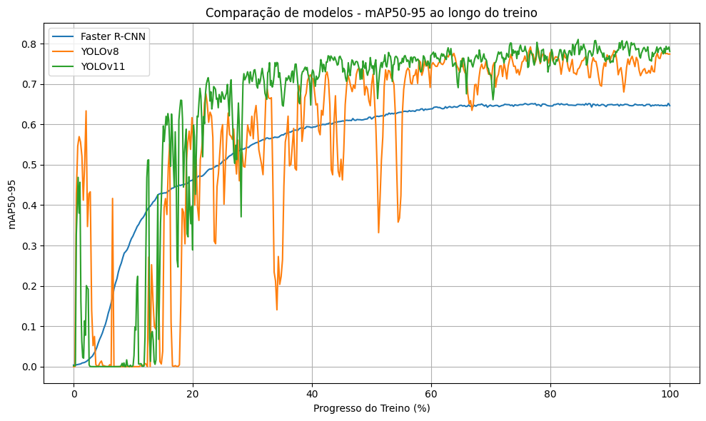
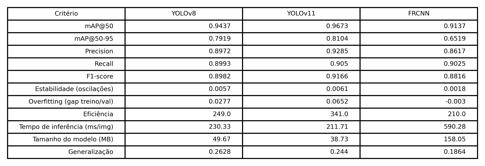
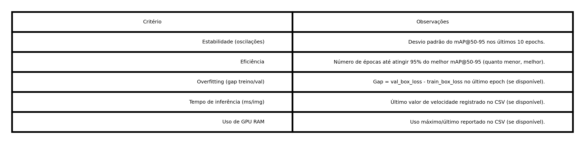

# DetectionIA Pipeline

Este README explica como instalar Podman ou Docker, como usar a automação com o `Makefile` do projeto 

## Instalação do Podman ou Docker

Este projeto pode ser executado em containers usando **Podman** ou **Docker**.  
Escolha uma das opções abaixo para instalar:

### Podman

macOS (Homebrew):

```bash
brew install podman
podman machine init
podman machine start
```

Debian/Ubuntu:

```bash
sudo apt-get update
sudo apt-get install -y podman
```

Verifique:

```bash
podman --version
podman info
```

### Docker

macOS (Docker Desktop):

```bash
brew install --cask docker
# Abra e inicie o Docker Desktop
```

Debian/Ubuntu (resumido):

```bash
sudo apt-get update
sudo apt-get install -y apt-transport-https ca-certificates curl gnupg lsb-release
curl -fsSL https://download.docker.com/linux/ubuntu/gpg | sudo gpg --dearmour -o /usr/share/keyrings/docker-archive-keyring.gpg
echo "deb [arch=$(dpkg --print-architecture) signed-by=/usr/share/keyrings/docker-archive-keyring.gpg] https://download.docker.com/linux/ubuntu $(lsb_release -cs) stable" | sudo tee /etc/apt/sources.list.d/docker.list > /dev/null
sudo apt-get update
sudo apt-get install -y docker-ce docker-ce-cli containerd.io
sudo usermod -aG docker $USER
# Efetue logout/login para ativar o grupo docker
```

Verifique:

```bash
docker --version
docker info
```

> Atenção: em servidores é comum usar Podman (rootless) ou Docker com permissões controladas. Escolha conforme a política de segurança do ambiente.

---

## Automação com Make

O repositório inclui um `Makefile` para tarefas como construir imagens (`create-image`) e container (`create-container`). Comandos:

```bash
make create-image     # constrói a imagem usando o runtime configurado (docker/podman)
make create-container # controi o container para treinamento 
# dentro do container
./training.sh
```

## Ajustes rápidos no `Dockerfile`

Se você estiver construindo em um servidor com GPU e encontra erros como "Package 'libgl1-mesa-glx' has no installation candidate", remova esse pacote do `Dockerfile` e substitua por 'libgl1'.

Exemplo alterado:

```dockerfile
RUN apt-get update && apt-get install -y --no-install-recommends \
	 git \
	 build-essential \
	 libglib2.0-0 \
     libgl1 \
	 vim \
	 && rm -rf /var/lib/apt/lists/*
```
## 📄 API Contract – Object Detection

🔹 Request 

```bash
{
    "image_url": "https:xpto",
    "report_id": 1,
}
```

🔹 Response

Retorno de um JSON estruturado com os resultados da detecção.

```bash
{
    "report_id": 1,
    "ìmage_url": "https:xpto",
    "ìmage_det": FormData,
    "detections": [
        {
            "id": 0,
            "class_id": 1,
            "class_name": "Joaninha",
            "confidence": 0.92,
            "bbox": {
                "xmin": 120,
                "ymin": 50,
                "xmax": 320,
                "ymax": 400,
            },
        },

        {
            "id": 1,
            "class_id": 2,
            "class_name": "Broca",
            "confidence": 0.92,
            "bbox": {
                "xmin": 120,
                "ymin": 50,
                "xmax": 320,
                "ymax": 400,
            },
        }
    ],

    "metadata": {
        "model": "frcnn",
        "model_version": "20250924v1",
        "classes": ["broca"],
        "input_size": [640, 640],
        "bbox_format": "xyxy",
        "inference_time_ms": 590.28
    }       
}
```

## Estrutura do diretório

Raiz do projeto:
```bash
.
├── common
│   └── utils.py
├── data
│   ├── train
│   │   ├── images
│   │   │   ├── 2025-04-24-08-40-18_315.jpg
│   │   └── labels
│   │   │   ├── 2025-04-24-08-40-18_315.txt
│   └── val
│       ├── images
│       └── labels
├── networks
│   └── structures.py
├── notebooks
│   └── figures
│   └── results.ipynb
├── test
│   └── 20250915v1
│       ├── data.yaml
│       └── args.yaml
├── training.sh
├── Dockerfile
├── Makefile
├── main.py
├── test.sh
├── requirements.txt
├── yolo11m.pt
└── README.md
```
### Comparação
  
Evolução do mAP50-95 no conjunto de validação interno para YOLOv8, YOLOv11 e Faster R-CNN.  

### Comparativo
  
Tabela consolidada: desempenho (mAP@50, mAP@50-95, Precision, Recall, F1), estabilidade, overfitting, eficiência, tempo de inferência, tamanho e razão de generalização.  

Critério (resumo rápido):  

mAP@50 / mAP@50-95: Qualidade global de detecção (localização + classificação).  
Precision: Proporção de detecções corretas (baixa → muitos falsos positivos).  
Recall: Cobertura dos objetos reais (baixa → muitos falsos negativos).  
F1-score: Equilíbrio entre Precision e Recall.  
Estabilidade: Desvio padrão dos últimos epochs (menor = treino consistente).  
Overfitting (gap): Diferença (val - train) em loss de boxes (alto = risco de overajuste).  
Eficiência: Época em que alcança 95% do melhor mAP (menor = mais rápido para ficar “quase ótimo”).  
Tempo de inferência: Latência média por imagem (ms).  
Tamanho do modelo: Peso em MB (impacta deploy).  
Generalização: (mAP externo / mAP interno) — retenção de performance fora do domínio original.  

### Observações
  
Definições resumidas dos critérios calculados.  